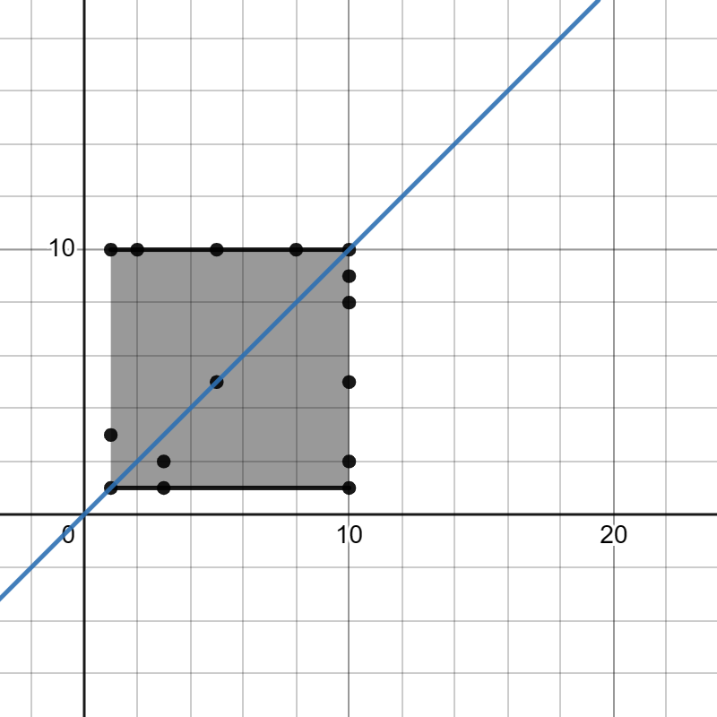

# Mini-Project
Based on Convex hull and Range queries
## Convex Hull
The convex hull of a shape is defined as the smallest `convex set` that contains it.

Convex hull of a Euclidean points is defined as the smallest convex polygon which contains all the given points inside or on the curve.

The [algorithm](convex_hull/main.cpp) will find convex hull of given 2d points and the [image](Images/100-points.png) is convex hull of 100 [random points](convex_hull/input.csv)

The algorithm also gives correct output in-case of collinear points

The convex hull of above points given by algorithm is (1, 1) (1, 10) (10, 10) (10, 1)

### [Algorithm](convex_hull/main.cpp)
- First sort the given 2 dimensional points
- Pick lowest left, highest right points as our boundray for upper and lower hulls
- Divide points into two parts upper and lower hull points
- Traverse to each point in upper hull from left to right and find the cross product with last two points if it is negative then take else remove that point
- Similarly for traverse each point in lower hull from right to left
