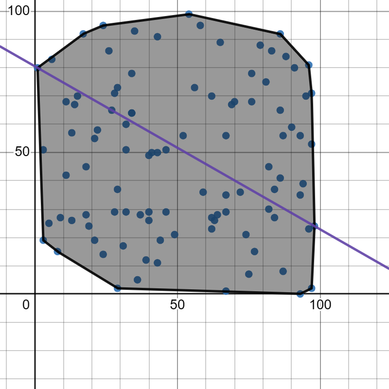

# Mini-Project
Based on Convex hull and Range queries
## Convex Hull
The convex hull of a shape is defined as the smallest `convex set` that contains it.

Convex hull of a Euclidean points is defined as the smallest convex polygon which contains all the given points inside or on the curve.
